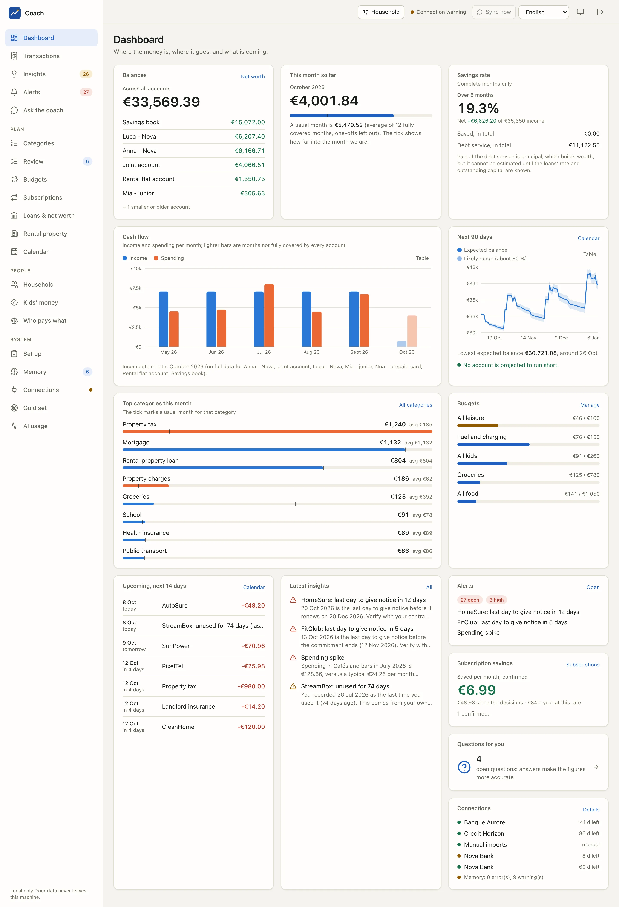
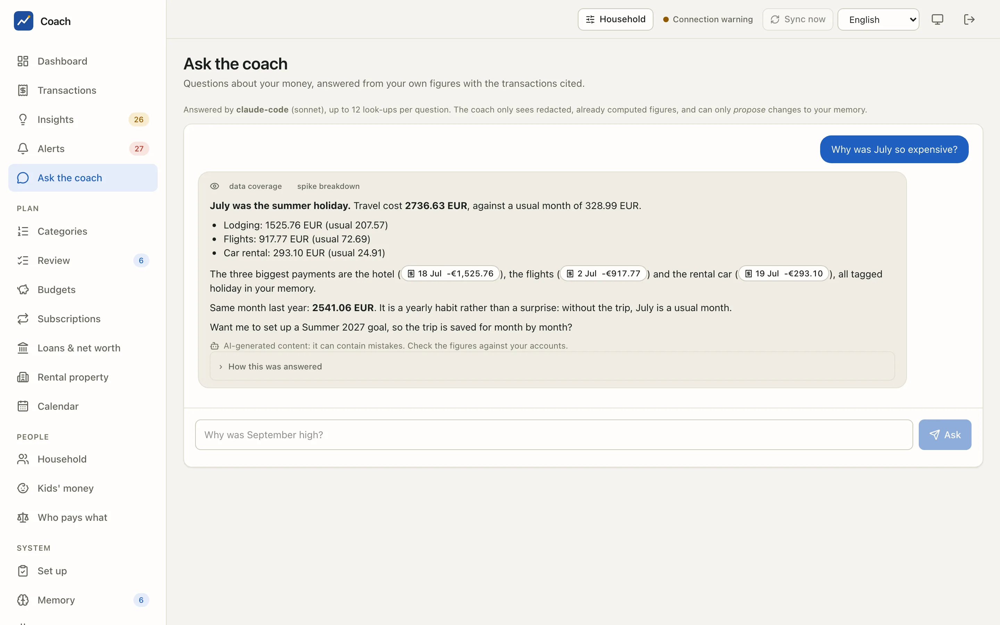
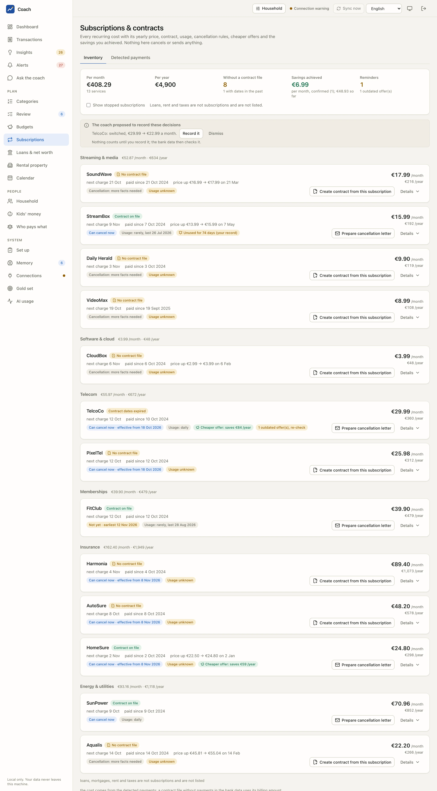
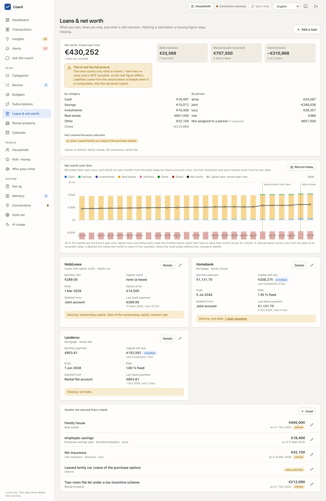
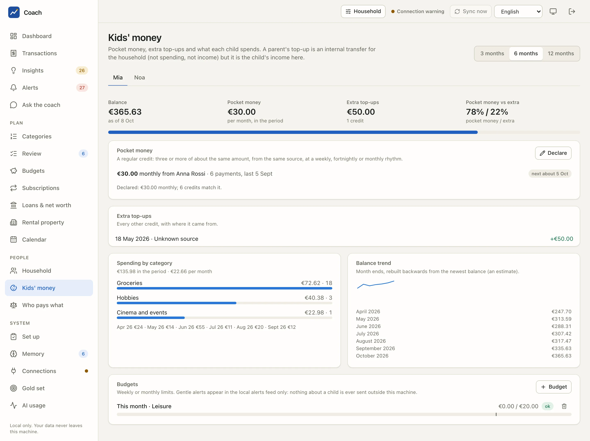
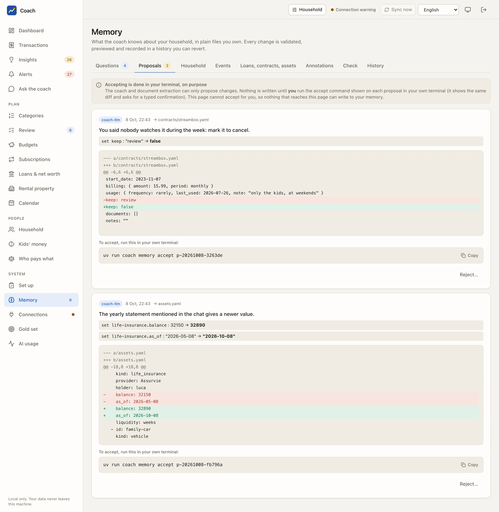

# AI finance coach

A private, self-hosted coach for your household's money. It pulls your bank transactions through the EU's open-banking rules (PSD2, via
[Enable Banking](https://enablebanking.com)), sorts them with rules, your own notes and, only for what is left, a language model, and then
answers questions like "why was September expensive?" and "which subscriptions should we review?" with **numbers computed by code, not
guessed by a model**. Everything is stored in an encrypted database on your own machine.

It is built for one household in France or Italy, runs on macOS or Linux (or in Docker), and costs nothing beyond the model you choose.

> **Not financial advice.** The coach explains your own spending and saving habits. It does not recommend investments, loans or insurers, and
> gives no tax or legal advice. Estimates (a mortgage renegotiation, a cancellation date) are labelled as estimates.
>
> **A personal open-source project.** It is maintained by one person who is not a financial, tax or legal professional (FR: AMF / CIF; IT: Consob),
> it has not been audited by a third party, it is not a regulated service and it comes with no warranty ([MIT](LICENSE)). You run it on your own
> machine, with your own bank data, at your own risk; read [docs/security.md](docs/security.md) before you trust it with a bank.

## Why you can trust it with bank data

* **No model in the data path.** Syncing, deduplication, recurring-payment detection, forecasts and budgets are plain code. A model labels
  only the merchants the rules and your memory leave open, and answers questions on request.
* **Numbers come from code, words come from the model.** The coach calls read-only tools that return computed, **redacted** results (account
  and people pseudonyms, hashed transaction references, generalised merchants); it never adds up raw rows, and every claim carries its evidence.
* **Your data stays yours.** The database is encrypted (SQLCipher); keys live in the macOS Keychain (or a 0600 secrets folder in Docker);
  the web app listens on `127.0.0.1` only behind a one-time login link; there is no telemetry, CDN or analytics.
* **You can see and cut every outbound path.** `coach privacy status` lists them (bank API, the model backend, optional alert channels),
  `coach privacy report` shows a local journal of every call (host, size, purpose: never a payload), and `[privacy] local_only = true` makes
  the whole thing run on a local model (Ollama) with the bank sync as the only network use.
* **The coach cannot change your records by itself.** It can only *propose* changes to the household memory; you accept them yourself in a
  terminal. Destructive commands (wipe, plain export) need a terminal and a typed phrase.

Details: [docs/privacy.md](docs/privacy.md) (data flows, retention, delete / export) and [docs/security.md](docs/security.md) (threat model, residual risks).

## What it does

| | |
|---|---|
| **Bank sync** | Enable Banking in restricted mode (free, your own accounts), the longest history the bank allows at first link (often 90 days to 2 years), daily incremental sync within the PSD2 limits, consent expiry warnings; CSV / OFX / CAMT.053 imports for banks you cannot link |
| **Categories** | Per-bank description parsers, a shared taxonomy, your corrections as permanent memory, a local nearest-neighbour step, then a model for the long tail |
| **Analytics** | Monthly averages without one-offs, recurring payments and price rises, anomalies, cash-flow forecast, budgets, goals, calendar of upcoming payments, year in review |
| **Subscriptions and contracts** | Inventory, duplicates, cancellation rules (FR / IT), cheaper-alternative search (interactive, sourced and dated), cancellation letters from a local template |
| **Loans and net worth** | Amortisation schedules, payment checks, renegotiation / insurance-delegation estimates, assets and liabilities |
| **Coach** | "Ask the coach" in the web app and CLI, weekly and monthly digests, 13 skills (monthly review, explain a spike, what-if, tax candidates...) through Claude Code, the Anthropic API or a local Ollama model |
| **Alerts** | In-app by default; ntfy / e-mail / Telegram only if you enable them, with minimal messages |
| **Household and people** | Members, account owners, who a transaction belongs to (rules, manual reassignment), one-person views, the children's pocket money and budgets (local-only alerts), transfers across the household's banks, who pays what, per-person logins (adult: everything, child: only their own money) |

## Screenshots

Made on the synthetic demo household of `scripts/demo/` (every name, bank and amount is invented). The full tour, the screencasts and
the user guide are on the documentation site: **https://mmornati.github.io/ai-finance-coach/**

| Dashboard | Ask the coach | Subscriptions |
|---|---|---|
|  |  |  |
| **Loans & net worth** | **Kids' money** | **Memory and proposals** |
|  |  |  |

Try it yourself without a bank or a model: `uv run python scripts/demo/seed_demo.py --home /tmp/coach-demo`, then
`scripts/demo/run_demo.sh /tmp/coach-demo` ([Try the demo](https://mmornati.github.io/ai-finance-coach/docs/getting-started/demo/)).

## Install

Pick one. All three end with `coach init` and `coach doctor`.

### 1. With uv or pipx (macOS, Linux)

```bash
uv tool install ai-finance-coach        # or: pipx install ai-finance-coach   (Python 3.11+; uv fetches one for you)
coach init                              # your private home (see below)
coach doctor
```

Try it without installing: `uvx --from ai-finance-coach coach doctor`. From a release file: `uv tool install ./ai_finance_coach-X.Y.Z-py3-none-any.whl`.
The package ships the built web app, the database migrations and the data files. (Installing straight from a git URL does *not* include the
web app, which is not committed: use a release, or build it from a checkout as in section 3.)

An installed package keeps its files in `~/.ai-finance-coach` (set `COACH_HOME` to change it; a `config.toml` in the current folder wins).

### 2. With Docker Compose (Linux, macOS, no Keychain needed)

```bash
cp -r <this repository> coach && cd coach           # or download a release
mkdir -p secrets coach-home/data coach-home/memory coach-home/config && chmod 700 secrets
for k in db_key backup_key proposal_key; do (umask 077; head -c 32 /dev/urandom | base64 | tr '+/' '-_' | tr -d '=\n' > secrets/$k); done
export COACH_UID=$(id -u) COACH_GID=$(id -g)
docker compose build
docker compose run --rm coach setup enablebanking   # then: docker compose run --rm coach setup
docker compose up -d                                # the web app on http://127.0.0.1:8765 only
```

The container runs as a non-root user with a read-only root filesystem, publishes the app on your loopback only, reads secrets from files,
and has no `claude` command (use the Anthropic API or Ollama). Back up `secrets/` in your password manager. Everything about it, including the
daily-job service and connecting a bank from a container: [docs/docker.md](docs/docker.md). (The Docker files are checked statically in the
tests; building the image needs network access and is not part of the automated checks.)

### 3. From source (to develop or contribute)

```bash
git clone https://github.com/mmornati/ai-finance-coach.git && cd ai-finance-coach
uv sync                                  # Python and all wheels; no brew needed
(cd web && pnpm install && pnpm build)   # the web app is built, not committed
uv run coach init
uv run coach doctor
```

See [CONTRIBUTING.md](CONTRIBUTING.md).

## Quick start (about 10 minutes)

1. **`coach init`** (1 min). Creates `config.toml` from the commented example, a private data folder, an empty memory skeleton (templates
   only), and the secrets (after you type `generate`; the values are never shown: back them up). Then an empty encrypted database.
2. **`coach doctor`** shows what is ready and what to do next.
3. **`coach setup enablebanking`** (5 min). Walks you through creating *your own* Enable Banking application in restricted mode: account,
   application, redirect URL to whitelist, the downloaded key, linking your accounts. Everyone needs their own application; none is shipped.
4. **`coach setup`** (4 min plus bank logins). The first-run wizard, resumable: connect your first bank (your browser opens on your bank's own
   login page), first sync (the longest history the bank allows), normalize and categorize (it first prints exactly what a model would receive,
   explains which backend gets it, and asks you to type `send`; or go fully local), then the onboarding interview about your household.
   Nothing leaves your machine without a typed confirmation at the step that does it.
5. **`coach ui`** opens the web app through a one-time login link. Ask the coach, review categories, set budgets.
6. Optional: `coach schedule install` (macOS) or `coach schedule loop` / the Docker `scheduler` profile for the daily job.

## Architecture

```
 Enable Banking (PSD2) ──┐   CSV / OFX / CAMT imports ──┐
                         ▼                              ▼
              ┌────────── ingest: sync, dedup, pending, balances, consents ──────────┐
              │                                                                      ▼
   memory/ (md + yaml,    ┌─ classify: bank parsers → memory notes → rules → kNN → LLM (long tail only, redacted)
   yours, local) ───────► │                                                          │
              ▲           └──────────────► encrypted SQLite (SQLCipher) ◄────────────┘
              │                                   │
              │            analytics (deterministic): averages, recurring, forecast, budgets, loans, net worth
              │                                   │
              │     finance MCP server: read-only, redacted tools + memory PROPOSALS (never writes)
              │                                   │
              └── you accept ◄── Coach runtime: Claude Code (claude -p) │ Anthropic API │ Ollama (local)
                                                  │
                    Web app (127.0.0.1, one-time login)  ·  CLI  ·  scheduler (launchd / loop)  ·  alerts (local; opt-in channels)
```

More: [docs/architecture.md](docs/architecture.md).

## Safety model for AI coding agents

If you run Claude Code (or another agent) in this folder, treat it as untrusted code running as you: it can read files and run commands with
your permissions. The project ships guard rails and a template:

* The agent talks to the data only through the **finance MCP tools** (redacted, read-only) and can only **propose** memory changes.
* [`docs/claude-settings.example.json`](docs/claude-settings.example.json) is a **template** of Claude Code permission rules built from the
  categories in [docs/security.md](docs/security.md): memory integrity, the web app's secrets and state, driving the web app, confirmation
  bypass (`--yes`), decisions and outside contact, destructive and plain-export commands, the Keychain, backups, and the configuration file
  (which holds the privacy switches). Copy it to `.claude/settings.json` of the project where you run the agent, read every line, and adjust.
  `.claude/settings.json` is git-ignored because it can hold absolute paths of your machine.
* `coach security audit` checks permissions, leftovers and exposure; `CLAUDE.md` gives the agent its working rules.

Permission rules mitigate; they do not prevent. The residual risks are listed honestly in [docs/security.md](docs/security.md).

## Documentation

| | |
|---|---|
| [docs/reference.md](docs/reference.md) | Every command and setting |
| [docs/docker.md](docs/docker.md) | Docker, secrets files, daily job in a container |
| [docs/architecture.md](docs/architecture.md) | Modules, data flows, trust boundaries |
| [docs/privacy.md](docs/privacy.md), [docs/security.md](docs/security.md) | Data flows, threat model, permission rules |
| [docs/enable-banking.md](docs/enable-banking.md) | The bank aggregator: regulation, what it sees, what this app calls |
| [docs/coach.md](docs/coach.md), [docs/skills.md](docs/skills.md) | The coach runtime and its skills |
| [docs/memory.md](docs/memory.md), [docs/analytics.md](docs/analytics.md), [docs/subscriptions.md](docs/subscriptions.md), [docs/loans.md](docs/loans.md), [docs/alerts.md](docs/alerts.md), [docs/household.md](docs/household.md), [docs/ui.md](docs/ui.md), [docs/quality.md](docs/quality.md) | The parts |
| [docs/i18n.md](docs/i18n.md) | Translations of the web app: adding a string or a language |
| [docs/release.md](docs/release.md) | The release checklist |
| [docs/research/](docs/research/) | The market and legal research behind the project |
| [CONTRIBUTING.md](CONTRIBUTING.md), [SECURITY.md](SECURITY.md), [CODE_OF_CONDUCT.md](CODE_OF_CONDUCT.md), [CHANGELOG.md](CHANGELOG.md) | Project |

## Honest limits

* One household, France and Italy (rules tables, taxonomy, bank description parsers). Other countries need parsers and rules: see CONTRIBUTING.
* Enable Banking's restricted mode covers *your own* accounts; each bank consent lasts at most 180 days and is renewed with `coach reconnect`.
  Who they are, what they see and keep, and exactly which read-only calls this app makes: [docs/enable-banking.md](docs/enable-banking.md).
* The `claude-code` backend uses your personal Claude subscription through `claude -p` and is meant for low-frequency personal use; use the API or
  Ollama for automation or sharing.
* LLM labels and answers can be wrong; they carry an "AI-generated" label, and every figure is checked against the tools' results.
* Alpha-quality in places: run `coach backup` before you trust it with a new bank, and read the residual risks.

## License

[MIT](LICENSE). Contributions are accepted under the same licence.
