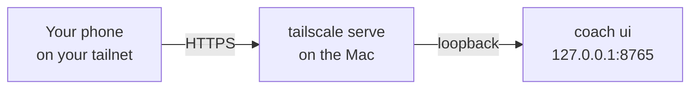
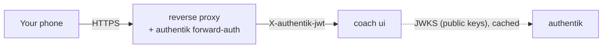

# Remote access

The web app listens on this machine only; to open it from your phone, put it behind Tailscale or a VPN, or behind your own
identity-aware proxy (an SSO such as authentik that signs every request in before it reaches the app). Never publish the port itself.

<div class="phones" markdown>
{ loading=lazy }
{ loading=lazy }
</div>

## Loopback by default

`coach ui` binds `127.0.0.1:8765`. Any other host is refused unless three settings agree. Why so strict: the app shows your whole
financial life, and plain HTTP over a network would expose the session cookie.

```toml
[ui]
host = "127.0.0.1"        # loopback only; keep it so behind a proxy
port = 8765
allow_remote = false      # true = accept requests for another host name
remote_tls_ack = false    # required with allow_remote: you confirm an HTTPS proxy terminates TLS in front of the app
allowed_hosts = []        # the host names to accept, e.g. ["mac.tailnet.ts.net"] (required with allow_remote)
session_hours = 12        # a browser session lasts this long
key_rotation_days = 30    # the session secret is replaced when older than this
open_browser = true       # `coach ui` opens your browser on the one-time login link
```

Every request's `Host` header is checked against loopback names plus `allowed_hosts` (protection against DNS rebinding); anything else is refused.

## Recipe: Tailscale



1. Put HTTPS in front of the loopback port:

    ```bash
    tailscale serve --bg 8765
    ```

2. Tell the app to accept that name:

    ```toml
    [ui]
    host = "127.0.0.1"
    allow_remote = true
    remote_tls_ack = true
    allowed_hosts = ["<machine>.<tailnet>.ts.net"]
    ```

3. Start the app with `uv run coach ui` and open the printed `https://<machine>.<tailnet>.ts.net/login#t=...` link on your device.
   Remote sessions use `Secure` cookies.

In Docker the port is published on the host's `127.0.0.1` only; put Tailscale in front of that port the same way.

## Signing in

There is no password page. `coach ui` prints a **one-time login link** on its own terminal. The token is in the link's `#` fragment, so the
browser never sends it to a server, a log or a referrer; it works once and for 2 minutes.

```bash
uv run coach ui --login-link                # a fresh one-time link (the server may already run)
uv run coach ui --rotate-session-key        # sign every browser out now
```

- A session lasts `session_hours` (12, up to 720). **Sign out of this browser** revokes it on the server, so a copied cookie dies too.
- The signing secret is replaced automatically after `key_rotation_days` (30), and on demand with `--rotate-session-key`. Use that if a
  device is lost or you think a link or cookie leaked.

## Signing in without the link

Two optional ways in, both off by default. The one-time link keeps working next to them: it is the enrolment path of a passkey and the
fallback when the proxy is down.

### Passkeys (Face ID, Touch ID, Windows Hello, a security key)

```toml
[ui]
passkeys = true
```

1. Open the app once with the one-time link, as usual.
2. **Household > Passkeys** (a child login: at the bottom of *My money*): "Add a passkey for this device", give it a name. The device
   makes a key pair; the app keeps only the public key, with the login it belongs to.
3. From then on the login page offers **Sign in with a passkey** on that device. Face ID or Touch ID opens the session.

What to know:

- A passkey is bound to the **host name** you use (the relying-party id): one made on `server.your-tailnet.ts.net` does not work on
  `localhost`, and the other way round. That binding is what makes it phishing-resistant. On this machine use `http://localhost:8765`
  (a bare `127.0.0.1` cannot be a relying party; the browser also needs https or localhost).
- A passkey belongs to one login (the owner, or a `coach users` login) and opens exactly that login, with its role; a child's passkey
  keeps the child scope. Disabling the login disables its passkeys.
- Lost a device? Remove its passkey on the same page (ten passkeys at most per login). `--rotate-session-key` signs every browser out
  but does not remove passkeys.
- Sign-in attempts are rate limited (10, then one every 30 s), the challenge is single-use and lives two minutes, a signature counter
  that goes backwards (a cloned authenticator) is refused.

### An identity-aware proxy: authentik

If your server already runs a reverse proxy with **authentik** forward-auth (Traefik, Caddy, nginx), every request reaches the app only
after authentik's own login (with its MFA or passkeys). The app can then trust that sign-in, with one condition: it verifies authentik's
**signed token** itself. A plain `X-authentik-username` header is never trusted, because anything that can reach the app's port (another
container on the proxy network, a process on the host) could send one.



```toml
[ui]
allow_remote = true
remote_tls_ack = true                          # the proxy terminates TLS
allowed_hosts = ["coach.example.net"]          # the public host name
sso = "authentik"
sso_jwks_url = "http://authentik:9000/application/o/<application slug>/jwks/"   # as the APP reaches authentik (container name)
sso_issuer = "https://authentik.example.net/application/o/<application slug>/"  # the token's `iss`; "" = not checked
sso_audience = "<client id of the proxy provider>"                              # the token's `aud`; "" = not checked

[ui.sso_users]
"marco" = "owner"              # authentik username, e-mail or subject -> the owner login (everything)
"anna@example.net" = "anna"    # -> a `coach users` login (adult or child, with its scope)
```

How it works: a request with no session cookie but with `X-authentik-jwt` (the token authentik's outpost adds) is checked against the
provider's public keys (JWKS), fetched from **your** `sso_jwks_url` (never the URL a header suggests), cached an hour and refreshed at
most once a minute when a token names an unknown key. Expiry is always checked; issuer and audience when set. The token's
`preferred_username`, `email` or `sub` is looked up in `[ui.sso_users]`; the mapped login must exist and be enabled; the ordinary
session cookie is then issued on that same response. CSRF, rate limits, the child scope and the audit log are unchanged. A page load
never gets a cookie, only an API call does.

The proxy side, with Traefik labels on the app's service (the middleware `authentik@file` is authentik's documented forwardAuth):

```yaml
labels:
  - "traefik.http.routers.coach.rule=Host(`coach.example.net`)"
  - "traefik.http.routers.coach.middlewares=authentik@file"
  - "traefik.http.services.coach.loadbalancer.server.port=8765"
  - "traefik.http.routers.coach-sso.rule=Host(`coach.example.net`) && PathPrefix(`/outpost.goauthentik.io/`)"
  - "traefik.http.routers.coach-sso.service=sso@file"
```

authentik's forwardAuth must list `X-authentik-jwt` and `X-authentik-meta-jwks` in its `authResponseHeaders` (authentik's own Traefik
template does).

When the identity is not mapped, the login page says which name authentik sent, so you can add it. When the token is refused (expired,
wrong issuer or audience, unknown key), the page says why in one word and `coach ui` logs the reason, never the token. **Sign out** revokes
the app's cookie and then goes to authentik's sign-out, or the session would reopen on the next request. `coach security audit` reports
the mode (a plain-http JWKS URL is a warning: fine on a private container network, never across the internet).

What this trusts: every request reaches the app through the proxy, and only there. Do not publish the app's port anywhere else, keep
authentik's own MFA on, and remember that whoever controls the authentik account controls the session. If the proxy is in front of the
public internet (a tunnel), the TLS terminator sees the traffic in clear: that is your decision, the app only verifies the signature.

## Per-person logins

Each member of the household can have their own login, created by you in a terminal (`coach users add`); its one-time link is
`coach ui --login-link --user ID`. A **child** login only reaches that child's own page (My money): every other endpoint is refused on the
server, deny by default. Disabling a login (`coach users disable`) signs it out on the next request. The web app cannot create, promote or
enable a login. Details: [Household](../household.md).

<div class="phones" markdown>
{ loading=lazy }
</div>

## Why never the internet

!!! warning "Do not publish the port"
    Never put the app on a public address, a router port forward or a bare `-p 8765:8765` in Docker. The login link, the cookie, CSRF
    tokens and rate limits are defence in depth, not a reason to face the internet. A private network you control (Tailscale, a VPN), or
    an identity-aware proxy that signs every request in before it reaches the app (the authentik recipe above), are the only supported
    ways in from another device.

The alerts' "Open the app" link (`[alerts] app_url`) also works from another device only through that same private network.

## Check it

```bash
uv run coach security audit          # bind settings, listening sockets, session key age, secrets, file permissions
```

A coach port listening on a non-loopback address, or a remote bind without `remote_tls_ack`, is reported as **critical**. A remote set-up
with the acknowledgement is a warning, as a reminder that it is on. The audit also reports the SSO mode (`ui_sso`: provider, mapped
identities, what the token is checked against) and whether passkeys are enabled (`ui_passkeys`).

## See also

- [Web app: Security model](../ui.md)
- [Security: threat model](../security.md)
- [Run it on a server](../getting-started/server.md)
- [Docker](../docker.md)
