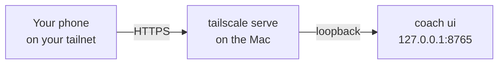

# Remote access

The web app listens on this machine only; to open it from your phone, put it behind Tailscale or a VPN, never on the internet.

<div class="phones" markdown>
{ loading=lazy }
{ loading=lazy }
</div>

## Loopback by default

`coach ui` binds `127.0.0.1:8765`. Any other host is refused unless three settings agree. Why so strict: the app shows your whole
financial life, and plain HTTP over a network would expose the session cookie.

```toml
[ui]
host = "127.0.0.1"        # loopback only; keep it so behind a proxy
port = 8765
allow_remote = false      # true = accept requests for another host name
remote_tls_ack = false    # required with allow_remote: you confirm an HTTPS proxy terminates TLS in front of the app
allowed_hosts = []        # the host names to accept, e.g. ["mac.tailnet.ts.net"] (required with allow_remote)
session_hours = 12        # a browser session lasts this long
key_rotation_days = 30    # the session secret is replaced when older than this
open_browser = true       # `coach ui` opens your browser on the one-time login link
```

Every request's `Host` header is checked against loopback names plus `allowed_hosts` (protection against DNS rebinding); anything else is refused.

## Recipe: Tailscale



1. Put HTTPS in front of the loopback port:

    ```bash
    tailscale serve --bg 8765
    ```

2. Tell the app to accept that name:

    ```toml
    [ui]
    host = "127.0.0.1"
    allow_remote = true
    remote_tls_ack = true
    allowed_hosts = ["<machine>.<tailnet>.ts.net"]
    ```

3. Start the app with `uv run coach ui` and open the printed `https://<machine>.<tailnet>.ts.net/login#t=...` link on your device.
   Remote sessions use `Secure` cookies.

In Docker the port is published on the host's `127.0.0.1` only; put Tailscale in front of that port the same way.

## Signing in

There is no password page. `coach ui` prints a **one-time login link** on its own terminal. The token is in the link's `#` fragment, so the
browser never sends it to a server, a log or a referrer; it works once and for 2 minutes.

```bash
uv run coach ui --login-link                # a fresh one-time link (the server may already run)
uv run coach ui --rotate-session-key        # sign every browser out now
```

- A session lasts `session_hours` (12). **Sign out of this browser** revokes it on the server, so a copied cookie dies too.
- The signing secret is replaced automatically after `key_rotation_days` (30), and on demand with `--rotate-session-key`. Use that if a
  device is lost or you think a link or cookie leaked.

## Per-person logins

Each member of the household can have their own login, created by you in a terminal (`coach users add`); its one-time link is
`coach ui --login-link --user ID`. A **child** login only reaches that child's own page (My money): every other endpoint is refused on the
server, deny by default. Disabling a login (`coach users disable`) signs it out on the next request. The web app cannot create, promote or
enable a login. Details: [Household](../household.md).

<div class="phones" markdown>
{ loading=lazy }
</div>

## Why never the internet

!!! warning "Do not publish the port"
    Never put the app on a public address, a router port forward or a bare `-p 8765:8765` in Docker. The login link, the cookie, CSRF
    tokens and rate limits are defence in depth, not a reason to face the internet. A private network you control (Tailscale, a VPN) is
    the only supported way in from another device.

The alerts' "Open the app" link (`[alerts] app_url`) also works from another device only through that same private network.

## Check it

```bash
uv run coach security audit          # bind settings, listening sockets, session key age, secrets, file permissions
```

A coach port listening on a non-loopback address, or a remote bind without `remote_tls_ack`, is reported as **critical**. A remote set-up
with the acknowledgement is a warning, as a reminder that it is on.

## See also

- [Web app: Security model](../ui.md)
- [Security: threat model](../security.md)
- [Run it on a server](../getting-started/server.md)
- [Docker](../docker.md)
