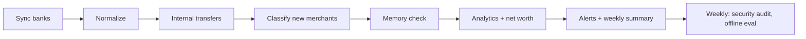

# Daily job & backups

One daily job keeps everything fresh: it syncs your banks, categorizes the new transactions, refreshes the analytics and checks for alerts.

<figure class="shot" markdown>
{ loading=lazy }
{ loading=lazy }
<figcaption>The Connections page shows the last scheduled run (steps, durations, failures), each consent's days left and the syncs left today.</figcaption>
</figure>

## Run it every day

=== "macOS (launchd)"

    ```bash
    uv run coach schedule install --dry-run   # print the plist, the launchctl commands and any preflight problem
    uv run coach schedule install             # write the LaunchAgent and load it
    uv run coach schedule status              # installed? loaded? last run
    uv run coach schedule uninstall
    ```

    `install` first checks that the job can work: the database opens, `db_key` is in the Keychain and Enable Banking is configured in
    `config.toml` (not in your shell environment, which launchd does not see).

    !!! note "The Keychain may ask once"
        macOS ties Keychain access to the Python binary that runs the job. After a uv Python upgrade it may prompt once (click
        "Always Allow"), or the job fails until you run `coach` interactively and approve it.

=== "Docker"

    ```bash
    docker compose --profile scheduler up -d   # adds the scheduler service: `coach schedule loop`
    ```

    Opt-in, because it contacts Enable Banking and your model backend every day. The time is the container's (usually UTC: set `TZ`
    for local time).

=== "Linux / a loop"

    ```bash
    uv run coach schedule loop             # the same job, every day at [schedule] time, without launchd
    uv run coach schedule loop --run-now   # run once immediately, then daily
    ```

    A restart never runs a missed time; a failing run is logged and the loop continues.

```toml
[schedule]
time = "07:30"          # HH:MM, local time
memory_check = true     # end with a warn-only `coach memory check`
analytics = true        # warn-only analytics refresh and a net-worth snapshot
eval = true             # once a week, a warn-only OFFLINE score of the gold set (no model is called)
```

## What a run does



| Step | What happens |
|---|---|
| sync | every connected account, within the daily PSD2 limit (`[sync] daily_limit`); consent warnings |
| normalize, transfers | parse the descriptions; propose (or, with `[transfers] auto_link`, link) internal transfers |
| classify | label new merchants: rules and memory first, then near-duplicates, then the model for the rest |
| memory check | warn-only; never fails the job |
| analytics, net worth | recurring series, anomalies, budget status; a net-worth snapshot |
| alerts | evaluate, keep, send to enabled channels; the weekly summary on its day |
| security, eval | once a week, warn-only: `coach security audit` and the offline gold-set score |
| coach digests | only with `[coach] schedule_weekly` / `schedule_monthly` (off by default), skipped when nothing is new |
| journal clean-up | egress journal rows older than `[privacy] egress_journal_days` are deleted |

The job exits non-zero when an account sync fails. Under `[privacy] offline` it skips the sync; a classify step refused by your privacy
settings is "skipped", not "failed".

## Logs

```bash
uv run coach logs                 # one line per run: id, start, outcome, duration, failed / warned steps
uv run coach logs --tail 20       # the last 20 events
uv run coach logs --run <id>      # every event of one run
```

Each run writes JSON lines to `<data_dir>/logs/runs.jsonl`, plus a one-line summary to `schedule.log`. A line holds a run id, a step name,
a status, a duration and counts: **never** a description, a name, an amount or an exception text.

```toml
[logs]
max_kb = 512          # rotate a log at this size (name.1, name.2 ...)
keep = 5              # rotated files kept per log
max_age_days = 90     # older rotated files are deleted at the start of a run
```

## Backups

```bash
uv run coach backup                         # an encrypted archive in [backup] dir; keeps the newest N
uv run coach restore FILE --to DIR          # restore into DIR only; never overwrites a file without --force
```

```toml
[backup]
dir = "backups"
retention = 14        # keep the 14 most recent archives
```

- An archive holds the database and `memory/`, encrypted with AES-256-GCM. The key is derived from the **`backup_key`** secret.
- The database is copied safely even while a sync runs; the archive is decrypted and checked before old ones are pruned.
- `restore` writes only into the `--to` folder. Moving files back into `data/` and `memory/` is a manual step, on purpose.
- The restored database is still encrypted: opening it needs the `db_key` that was in use when the backup was taken.

!!! warning "Keep both keys"
    Without `backup_key` an archive cannot be read; without the matching `db_key` the restored database cannot be opened. Store both in
    your password manager.

!!! tip "A safe playground"
    Restore a backup into a scratch folder and point `COACH_DB`, `COACH_MEMORY_DIR`, `COACH_DATA_DIR` and `COACH_CONFIG_DIR` at it to try
    a change on realistic data without touching the real one.

## See also

- [CLI reference: Scheduler and Backups](../reference.md)
- [Quality: logs and observability](../quality.md)
- [Docker: the daily job](../docker.md)
- [Connections in the guide](../guide/connections.md)
