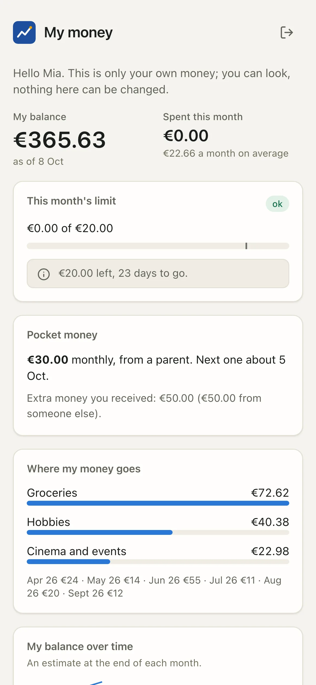

# Try the demo

The repository ships a complete, invented household so you can explore every page of the app, and ask the coach, without a bank, a model or an API key.

<video class="cast" src="../../assets/video/ask-coach.mp4" poster="../../assets/video/ask-coach.webp" autoplay muted loop playsinline></video>

Every screenshot and screencast of this documentation was made on this demo. Nothing in it comes from a real home.

## What the demo household contains

The Rossi family: two adults, Anna and Luca, and two children, Mia (born 2012) and Noa (2015). The data covers the 24 months before
today, so the demo always looks current.

| Area | What you find |
|---|---|
| **Accounts** | 7 accounts: a joint account and a savings book at Banque Aurore, one account each for Anna and Luca plus Mia's junior account at Nova Bank, a rental flat account at Credit Horizon (all three banks are invented), and Noa's prepaid card brought in as a file import. |
| **Consents** | One bank consent is close to expiry, so you see the warnings of the Connections page. |
| **Transactions** | 24 months of salaries, groceries (Acme Grocers, Fresh Market), restaurants, energy and water bills, a summer holiday (AirVola, Hotel Miramare), pocket money and transfers between the family's accounts. |
| **Loans and assets** | A mortgage (Homebank), a car lease (MobiLease), the family house, savings and a life-insurance balance. |
| **Rental property** | A two-room flat let under a Pinel-type tax-incentive scheme, with its own loan (Lenderco), rent cap, tenant income limit and a vacancy between two tenants. |
| **Subscriptions and contracts** | StreamBox, VideoMax, SoundWave, CloudBox, OldApp, TelcoCo, PixelTel, HomeSure, FitClub and more, several with a contract file, recorded cheaper alternatives and savings decisions. |
| **Plans** | Budgets, goals (an emergency fund among them), open questions and memory proposals waiting for review. |
| **Signals** | Alerts, coach insights and an AI usage history. |
| **Logins** | A child login for Mia (she only sees her own money) and an adult login for Luca. |

<figure class="shot" markdown>
{ loading=lazy }
{ loading=lazy }
<figcaption>The demo's Connections page: three invented banks, a consent about to expire and the prepaid card import.</figcaption>
</figure>

## Run it

You need a source checkout ([Install](install.md), "From source"), `uv`, and Node with `pnpm` to build the web app once.

1. **Build the web app** (once; the built app is not committed):

    ```bash
    cd web && pnpm install && pnpm build && cd ..
    ```

2. **Create the demo home** in an empty folder:

    ```bash
    uv run python scripts/demo/seed_demo.py --home /tmp/coach-demo
    ```

    It prints the balance of each account as it goes. Everything (configuration, database, memory, secrets) is written inside that folder.

3. **Start the app** on the demo home:

    ```bash
    scripts/demo/run_demo.sh /tmp/coach-demo
    ```

4. **Open the one-time login link** the command prints (`http://127.0.0.1:8799/login#t=...`). You land on the dashboard as the owner, who
   sees everything.

5. **See what a child sees.** In another terminal, print a link for Mia's login and open it in a private window:

    ```bash
    uv run python scripts/demo/login_link.py /tmp/coach-demo --user mia
    ```

<div class="phones" markdown>
{ loading=lazy }
{ loading=lazy }
</div>

!!! tip "Things to try"
    - **Ask the coach**: "Why was July so expensive?", "Which subscriptions should we review?", "Are we OK next month?"
    - **Memory > Proposals**: the changes the coach suggested, waiting for a human.
    - **Rental property**: the scheme commitment and the tax-year candidates.
    - **Kids' money** and **Who pays what**: the household views.

## The coach in the demo

The demo has no model. Its "coach" is a scripted stand-in for the `claude` command, put first on the `PATH` by `run_demo.sh`:

1. It reads your question and picks the closest of a few prepared scenarios (a month that was high, the subscriptions, next month's
   forecast, or a three-month summary by default).
2. It starts the **real** finance tool server and makes **real** tool calls on the demo data (`explain_spike`, `subscription_audit`,
   `forecast`, `calendar`, `cashflow`...). You see each look-up under "How this was answered".
3. It fills a pre-written answer with the figures and evidence refs those tools returned.

So the redaction, the evidence refs and every number are genuine; only the wording is canned. No network, no API key, no cost. A question
that matches no scenario gets the default summary.

<figure class="shot" markdown>
{ loading=lazy }
{ loading=lazy }
<figcaption>"Why was July so expensive?": the tool calls, then an answer whose figures come from the tools.</figcaption>
</figure>

## Safety rails

The demo scripts are written so they cannot touch a real home:

- `seed_demo.py` **refuses a folder that is not empty** unless it carries the demo marker file it wrote itself (`.coach-demo-home`).
- `run_demo.sh` and `login_link.py` refuse any folder without that marker.
- Secrets use the file backend inside the demo folder, never your Keychain. Any `COACH_*` or Enable Banking variable of your shell is
  ignored while the demo is built.
- The demo database is a **plaintext** SQLite file (`insecure_plaintext_db = true`). That is acceptable only because every row is invented.

!!! warning "Never point the demo at real data"
    The demo configuration turns off database encryption and uses a scripted coach. Use it for invented data only. For your own money,
    follow the [Quickstart](quickstart.md).

## Rebuild it

The demo is anchored on today's date. To refresh it (or after pulling a new version), rebuild it in place:

```bash
uv run python scripts/demo/seed_demo.py --home /tmp/coach-demo --force
```

`--force` only works on a folder that already holds a demo. Another port: `--port 8800` when you create it.

## How the screenshots of these docs are made

`scripts/demo/shoot.py` drives a headless Chromium (Playwright) against the running demo app. It logs in with a one-time link of the demo
home, then saves light and dark WebP screenshots of every page, a few phone-sized ones, Mia's own view, and with `--video` the short
screencasts of the main flows:

```bash
scripts/demo/run_demo.sh /tmp/coach-demo &
uv run --with playwright --with pillow python scripts/demo/shoot.py /tmp/coach-demo --out docs/assets/screens
```

`--only dashboard,coach` limits it to some pages. Like the other demo scripts, it only works against a demo home.

### The narrated film

`scripts/demo/make_film.py` turns the screencasts into the film of the home page, once per language (`film.en.mp4`, `film.fr.mp4`,
with WebVTT subtitles and a poster). Title cards are rendered by headless Chromium. The voice-over comes from
[Kokoro](https://github.com/thewh1teagle/kokoro-onnx), an open-weight neural speech model (Apache-2.0) that runs on your machine:
no account, no key, and the narration never leaves the computer. Each scene lasts as long as its picture or its narration, and the
voice is normalised to -16 LUFS.

```bash
brew install espeak-ng           # the phoneme library Kokoro needs (Debian / Ubuntu: apt install espeak-ng)
# download kokoro-v1.0.onnx and voices-v1.0.bin (model-files-v1.0 release of kokoro-onnx) into ~/kokoro
uv run --with playwright --with pillow --with kokoro-onnx --with phonemizer-fork --with soundfile \
    python scripts/demo/make_film.py --kokoro-dir ~/kokoro --lang en,fr
```

The narration and the title cards of each language are at the top of the script. `--tts edge` uses Microsoft Edge's online voices
instead (through the open-source `edge-tts` client), when that service accepts the client.

## See also

- [Install](install.md) and [Quickstart](quickstart.md): the real thing, on your own data
- [Ask the coach](../guide/coach.md): what the coach can answer
- [The coach (LLM)](../coach.md): the runtime, the backends and the tool loop
