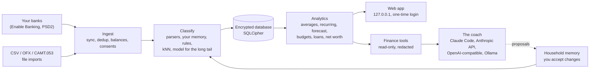

# Getting started

AI Finance Coach is a private, self-hosted coach for one household's money: it syncs your bank accounts, sorts every payment and answers your questions with figures computed by code.

<figure class="shot" markdown>
{ loading=lazy }
{ loading=lazy }
<figcaption>The dashboard of the demo household: balances, this month against a usual month, cash flow and forecast.</figcaption>
</figure>

## What it is

- **For one household.** Several adults and children, their accounts, loans, contracts and a rental flat if you have one. Everything is
  built around France and Italy: the category taxonomy, the bank description parsers, the cancellation and tax rules.
- **Self-hosted.** It runs on your Mac, a Linux machine or in Docker. The database is encrypted (SQLCipher) and the web app listens on
  `127.0.0.1` only, behind a one-time login link. There is no telemetry, no CDN and no analytics.
- **Bank sync through PSD2.** Your transactions arrive through [Enable Banking](https://enablebanking.com), using *your own* free application
  in restricted mode. Banks you cannot link can be imported from CSV, OFX or CAMT.053 files.
- **A coach that knows your numbers.** Ask "why was July expensive?" or "which subscriptions should we review?" in the web app, the terminal or
  Claude Code. The answer cites the payments it is based on.

!!! note "Not financial advice"
    The coach explains your own spending and saving habits. It does not recommend investments, loans or insurers, and gives no tax or legal
    advice. Estimates (a mortgage renegotiation, a cancellation date) are labelled as estimates.

## Three principles

| Principle | What it means for you |
|---|---|
| **No model in the data path** | Syncing, deduplication, recurring-payment detection, forecasts and budgets are plain code. A model only labels the merchants your rules and memory leave open, and answers questions when you ask. |
| **Numbers come from code, words come from the model** | The coach calls read-only tools that return computed, redacted results. It never adds up raw rows itself, and every claim carries its evidence ref. |
| **The coach only proposes** | It cannot change your records. It writes *proposals* for the household memory; you review them and accept them yourself, in a terminal. |

Why this matters: a language model is good with words and bad with arithmetic, and a merchant name written by a stranger can hold an injected
instruction. Keeping the model away from the figures and away from your files removes both risks at the root.

## How your data flows

The model sees pseudonyms (account-main-1, adult-1), hashed transaction refs and
computed figures. Real names, IBANs and account labels stay on your machine.

## Pick your path

-   :material-play-circle-outline:{ .lg .middle } **Try the demo**

    ---

    Run the whole app on an invented household in two commands. No bank, no model, no API key.

    [:octicons-arrow-right-24: Try the demo](demo.md)

-   :material-download-outline:{ .lg .middle } **Install**

    ---

    With uv or pipx, with Docker Compose, or from a source checkout.

    [:octicons-arrow-right-24: Install](install.md)

-   :material-timer-outline:{ .lg .middle } **Quickstart**

    ---

    From an empty folder to your first categorized month in about ten minutes.

    [:octicons-arrow-right-24: Quickstart](quickstart.md)

-   :material-server-outline:{ .lg .middle } **Run on a server**

    ---

    A home server in Docker, the daily job, backups and remote access through Tailscale.

    [:octicons-arrow-right-24: Run it on a server](server.md)

## Requirements

| You need | Notes |
|---|---|
| **macOS, Linux or Docker** | On macOS the secrets live in the Keychain. On Linux and in Docker they are files readable by you only (mode 0600). |
| **Python 3.11 or newer** | Only for a uv / pipx install or a source checkout. `uv` fetches a suitable Python for you. Not needed with Docker. |
| **An Enable Banking account** | Free in restricted mode, for your own accounts. Everyone creates their own application: none is shipped. See [Connect your banks](banks.md). |
| **A model backend** *(optional)* | Claude Code (your Claude subscription), the Anthropic API, an OpenAI-compatible provider (OpenRouter, Eden AI, vLLM) or a local Ollama model. Without one, rules and your memory still categorize, and every page of the web app works. |
| **Node and pnpm** *(source checkout only)* | To build the web app once. Released packages and the Docker image already contain it. |

!!! tip "Honest limits"
    One household, France and Italy. Each bank consent lasts at most 180 days and has to be renewed. Model labels and answers can be wrong:
    they carry an "AI-generated" label, and every figure comes from the tools. Run `coach backup` before you trust it with a new bank.

## See also

- [Architecture](../architecture.md): modules, data flows and trust boundaries
- [Privacy](../privacy.md) and [Security](../security.md): what may leave your machine, the threat model, residual risks
- [User guide](../guide/index.md): every page of the web app
