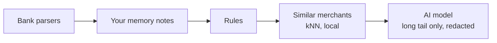

# Categories & review

See what a usual month costs in each category, drill into any of them, and teach the app the merchants it is unsure about.

<figure class="shot" markdown>
{ loading=lazy }
{ loading=lazy }
<figcaption>Categories grouped by area, each with its usual month, this month and last month.</figcaption>
</figure>

## The overview

The header gives **A usual month, whole household**: the average of the months fully covered by every account, one-offs left out (here,
12 months). Below it, each category shows:

| Column | Meaning |
|---|---|
| **Usual month** | the coverage-aware average, with the number of months behind it ("12 mo.") |
| **This month** | spent so far this month |
| **Last month** | spent last month |

Switch between **Grouped** (by area: Housing, Food, Travel, Transport...) and **Ranked** (all categories, biggest first). **Filter
categories** narrows the list as you type.

Two small badges help you read the figures:

- **lumpy**: a seasonal category (flights, lodging, renovation works). Its average needs 12 covered months to mean something.
- **low confidence**: few fully covered months back the figure. A category with no covered month at all is listed apart, with "no fair
  average", instead of being divided by 12.

## The drill-down

Click a category (or a group) to open its page.

<figure class="shot" markdown>
{ loading=lazy }
{ loading=lazy }
<figcaption>Groceries: month by month, a usual month, the trend, the merchants and the one-offs.</figcaption>
</figure>

- **Month by month**: **Regular** spending and **One-offs** per month with the **Monthly average** as a dashed line. Lighter bars are months
  not fully covered by the accounts that carry this category; a dashed bar is the month in progress. **Table** shows the numbers.
- **A usual month**: **Without one-offs** (the figure the app uses), the number of fully covered months, **With one-offs**, and the accounts
  it is **Based on**.
- **Trend**: the last 3 covered months against the 3 before. It needs six covered months.
- **Merchants, last 12 months**: who you pay in this category, with the number of transactions, the share and the last date.
- **One-offs**: what was tagged one-off and left out of the usual month.

**See transactions** opens [Transactions](transactions.md) filtered on this category.

## How a category is decided

Each transaction goes through a pipeline. The first step that knows the answer wins, and the expensive or less private steps run only
for what the earlier ones could not decide.



| Step | What it does |
|---|---|
| **Bank parsers** | Clean the raw description of each bank (card payment, direct debit, transfer prefixes) into a merchant key. |
| **Your memory** | Your labels for a merchant, your per-transaction overrides and your memory annotations. They always win over what follows. |
| **Rules** | Built-in rules for the kind of operation and well-known patterns (internal transfers, loan instalments, taxes...). |
| **Similar merchants** | A local nearest-neighbour step labels near-duplicates of merchants already known. Nothing leaves the machine. |
| **AI model** | Only the merchants nothing else could label. |

!!! info "What the AI model receives, and when"
    Only **redacted** merchant descriptors (IBANs, e-mails, phone numbers, long digit runs, ids and household names removed), the
    category list and a few labelled examples. Merchants that look like a person are **never sent**. `coach classify run --dry-run` prints
    the exact requests and sends nothing. In the first-run wizard (`coach setup`) the categorize step shows that dry run first and asks
    for your privacy choice before anything is sent. With `local_only` and an Ollama backend, the model runs on your machine. Without any
    backend, rules and your memory still categorize. See [Privacy](../privacy.md).

The transaction panel shows this chain for any transaction (**Why this category?**), with the step that decides and the ones it outranked.

## The review queue

<figure class="shot" markdown>
{ loading=lazy }
{ loading=lazy }
<figcaption>Merchants to review, biggest money first.</figcaption>
</figure>

**Review** in the sidebar lists the **Merchants to review**: labels the app is unsure about, **biggest money first**, so a few minutes
fix the figures that matter most. Each row shows why it is there:

| Badge | Meaning |
|---|---|
| **Unsure label** | the current label has a low confidence (shown as "62% sure") |
| **Uncategorized** | no step could label it |
| **Not labelled yet** | the merchant has no label |
| **May be a person (never sent to an AI)** | it looks like a person, so only you can say what it is |

For each merchant, either **Keep** the current category (it becomes your own label) or pick another one and press **Set**.

!!! tip "You teach it once"
    Confirming or correcting a merchant teaches the app for **every transaction with that merchant**, past and future. Your labels
    override rules and AI labels, and serve as examples for the AI on the merchants it still has to label.

A label guessed from a similar merchant asks you to pick the category yourself rather than confirm it blindly.

## The taxonomy

Categories have two levels, `group.leaf`, for example `food.groceries` or `housing.rental_property_loan`. The groups are income,
transfer, housing, food, transport, shopping, health, personal care, leisure, subscriptions, travel, kids, education, insurance, pets,
debt, cash, fees, taxes, charity and other. Transfers between your own accounts and to people are never spending or income.

The AI may only answer with ids of this taxonomy. You can add or rename a leaf with `coach taxonomy add` / `rename`.

## From the terminal

```bash
uv run coach classify review --max-conf 0.7 --limit 30   # the review queue, by money at stake
uv run coach classify correct "<merchant_key>" food.groceries --name "Fresh Market"
uv run coach classify run --dry-run                       # the exact redacted requests, nothing sent
uv run coach classify report                              # coverage and monthly spending
uv run coach explain "ACME GROCERS"                       # why one transaction has its category
uv run coach taxonomy list
```

The Claude Code skills `review-categories` and `categorize-transactions` walk you through the same steps in a conversation.

## See also

- [Transactions](transactions.md): change one category from the side panel.
- [Quality & AI usage](quality.md): measure how good the categories are.
- [Analytics reference](../analytics.md), [Architecture](../architecture.md), [Privacy](../privacy.md).
