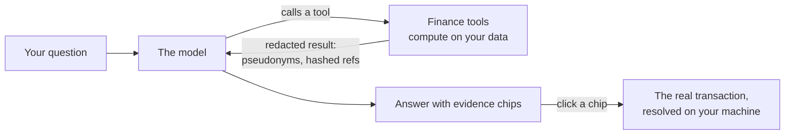

# Ask the coach

Ask a question about your money in plain words and get an answer built from your own figures, with the transactions it is based on.

<video class="cast" src="../../assets/video/ask-coach.mp4" poster="../../assets/video/ask-coach.webp" autoplay muted loop playsinline></video>

<figure class="shot" markdown>
{ loading=lazy }
{ loading=lazy }
<figcaption>Ask the coach: pick a suggested question or type your own.</figcaption>
</figure>

## The one rule: numbers come from code, words come from the model

The coach never reads your bank statements. It calls a set of **finance tools** that compute the figures (averages, cash flow, recurring
payments, anomalies, forecast...) and return them **redacted**. The model's job is to pick the right tools, read their results and
explain them. It is told never to compute a number itself, and every number it writes is checked against what the tools returned.



## What you see

The line under the title says which backend and model answer, and how many look-ups a question may use (for example
"Answered by **claude-code** (sonnet), up to 12 look-ups per question").

<figure class="shot" markdown>
{ loading=lazy }
{ loading=lazy }
<figcaption>"Why was July so expensive?": the tools the coach looked at, the answer, the evidence chips and the AI-generated label.</figcaption>
</figure>

An answer has these parts, from top to bottom:

1. **What the coach looked at.** Next to the eye icon, one badge per tool it called: "data coverage", "spike breakdown",
   "subscription audit"... While it works you see "Looking at your figures…".
2. **The answer**, streamed as it is written.
3. **Evidence chips.** A chip with a date and an amount (`18 Jul -€1,525.76`) is a transaction: click it to open that transaction in
   [Transactions](transactions.md). A **Recurring payment** chip opens the series. The mapping from the model's reference to the real
   transaction happens on your machine; the model never knows which transaction it was.
4. **The AI-generated label**: "AI-generated content: it can contain mistakes. Check the figures against your accounts."
5. **How this was answered** (click to open): backend, model, number of look-ups, tokens in and out, an approximate cost (notional on a
   subscription) and the time it took.

Some answers carry extra notices:

| Notice | What it means |
|---|---|
| "N numbers in this answer could not be traced to a computed figure" | a number did not appear in any tool result. Often a sum the model made: check it before relying on it |
| **General information only** | the answer touched on investment products. The banner reminds you it is not personalised investment advice; for a specific product, ask a regulated adviser |
| **Suspicious text in your data** | a merchant name or description looked like an instruction aimed at the coach. It was treated as data and ignored |
| **Proposal p-...: nothing is changed yet** | the coach suggests a change to your memory. See below |

While a question runs, the **Ask** button becomes **Cancel**. The coach answers one question at a time, and each question stands alone:
it does not remember the previous one, so put the whole context in your question.

<figure class="shot" markdown>
{ loading=lazy }
{ loading=lazy }
<figcaption>"Which subscriptions should we review?" runs the subscription audit: savings ranges computed by code, each claim with its evidence.</figcaption>
</figure>

## What you see vs what the model sees

Every tool result is rewritten before the model reads it. Here is how the demo household looks on each side:

| You see (in the app) | The model sees |
|---|---|
| Anna Rossi | <span class="pseudo">adult-1</span> |
| Mia Rossi | <span class="pseudo">kid-1</span> |
| Joint account | <span class="pseudo">account-main-1</span> |
| A transaction (18 Jul, -1,525.76 at Hotel Miramare) | <span class="pseudo">h_xxxxxxxxxx</span>, with its date, amount and category |
| A small local shop | <span class="pseudo">[merchant:food.groceries]-xxxxxx</span> |
| The payer of a salary | <span class="pseudo">[employer]</span> |
| A school you declared | <span class="pseudo">[school]</span> |

Subscriptions, bills and businesses you pay often (StreamBox, TelcoCo...) keep their name; person-like names and small unknown
businesses are generalised. Every free-text value is wrapped and marked as untrusted, so a merchant called "ignore your instructions" stays a
merchant name. A last check runs on every output: if a member name, an account label, an IBAN, an e-mail or a path slipped through, the
whole result is withheld.

!!! info "Coarse and standard"
    `[privacy] model_detail = "coarse"` (the default) generalises the most. `"standard"` keeps more merchant names and lets the coach read
    your coach rules in `preferences.md`. Names of people are scrubbed in both. See [Privacy modes](../configuration/privacy.md).

## Questions to try

The suggested questions of the page are a good start. Some of them run a ready-made **skill** (hover to see which one):

- Why was last month's spending so high?
- Where could we save the most each month?
- Which subscriptions should we review?
- Can we afford a 3,000 EUR expense in the next two months?
- Give me the year in review.
- Review last month
- Explain why last month's spending was high
- Audit my subscriptions
- Which of my contracts can I cancel now?
- Check my mortgage
- What if I cancel my biggest software subscription?
- Which expenses could lower my taxes?
- Help me finish setting up the coach

<div class="phones" markdown>
{ loading=lazy }
</div>

## The coach proposes, you decide

The coach cannot change anything about your household. When an answer suggests a change ("the yearly statement gives a newer value"),
it creates a **proposal**: a sealed, validated diff. The answer shows its id and the command to run.

1. Review the diff in [Memory > Proposals](memory.md#proposals).
2. Accept it yourself, in your own terminal: `uv run coach memory accept p-...`. The command shows the diff again and asks you to type a
   confirmation.

There is no button to accept a proposal in the web app, on purpose: nothing that reaches the page can write into your memory.

## Which model answers

The `[coach] backend` setting chooses who answers:

| Backend | In short |
|---|---|
| `claude-code` (default) | headless Claude Code on your own Claude subscription; for a few personal questions a day |
| `anthropic-api` | the Anthropic API with your API key, billed per token |
| `openai-compatible` | OpenRouter, Eden AI or a self-hosted server such as vLLM; the model must support tool calling |
| `ollama` | a local model on this machine; nothing leaves it. The model must support tool calling |

Set-up, keys and costs: [AI models](../configuration/models.md). Every question is logged in [AI usage](quality.md#ai-usage).

## Digests: the coach writes to you (opt-in)

With `[coach] schedule_weekly = true` (and `schedule_monthly = true`) the daily job also asks the coach for a weekly digest and a monthly
review, but only when there is new data since the last one. They land in [Insights](insights-alerts.md) with their evidence. Both are off
by default.

## From the terminal

```bash
uv run coach coach ask "Why was September high?"
uv run coach coach ask --skill monthly-review --month 2026-09
uv run coach coach skills                         # the skills and how to run them
uv run coach coach digest --weekly --dry-run      # the exact prompts and redacted tool outputs; no model is called
```

`coach coach ask` uses the same tools, the same redaction and the same checks as the web page. It never searches the web.

## Good to know

- No investment-product advice: the coach coaches budgeting, spending and saving habits. It names no fund, share, lender or insurer.
- If a figure is not available, the coach should say so rather than guess. If it guesses anyway, the unverified-number warning shows it.
- Answers are kept as insights of kind **Answer**, so you can find them again in [Insights](insights-alerts.md).

## See also

- [Coach reference](../coach.md): the tools, the privacy model, prompt-injection protection, backends and costs.
- [Privacy reference](../privacy.md): every path data can take out of this machine.
- [Skills reference](../skills.md): what each ready-made analysis does.
