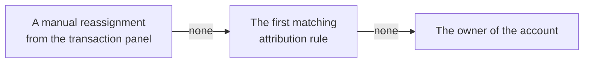
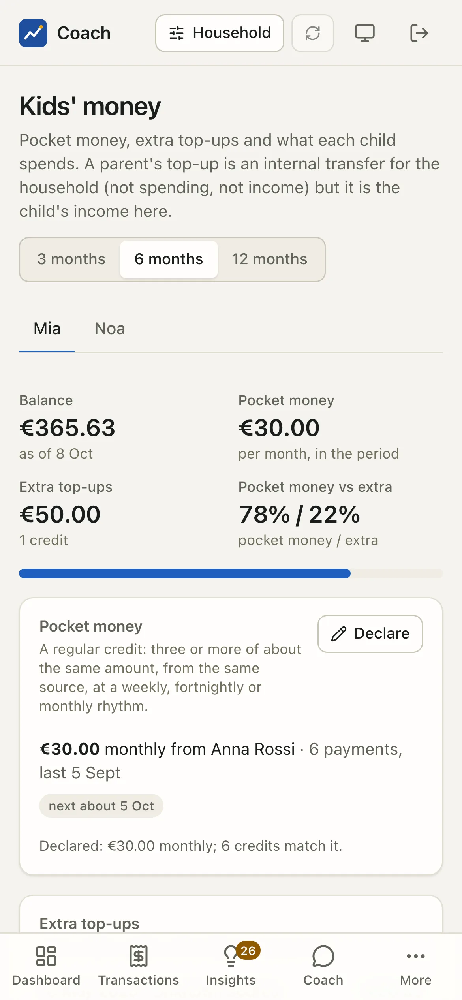

# Household & kids

One household, several people: who owns each account, whose each payment is, what the children do with their money, and who pays what.

<figure class="shot" markdown>
{ loading=lazy }
{ loading=lazy }
<figcaption>The Rossi family: two adults, two children, seven accounts with an owner and a purpose, two attribution rules.</figcaption>
</figure>

Three pages live under **People** in the sidebar: **Household**, **Kids' money** and **Who pays what**.

## The Household page

### Members

The members come from `memory/household.yaml`: name, role (`adult` or `child`), birth year, how many accounts they own and how many
transactions are attributed to them. The list is read-only here; add or change members with `uv run coach memory member add` or on the
[Memory](memory.md) page.

!!! note "Names stay on this machine"
    A model only ever sees `adult-1`, `kid-1`... never a name, an alias, a birth year or the label of a rule. For age it gets a band
    (`adult`, `under 6`, `6-11`, `teen`), nothing more precise.

### Accounts: owner and purpose

Each account has an **owner** (**Joint**, or one member) and a purpose (**Used for**: Main, Savings, Rental, Kids, Cards). Change them in
place with the two drop-downs. The owner is the default person of every transaction on that account; the **Attributed to** column shows
the result (for example "Joint 1117 · Luca 24" on the joint account).

### Attribution rules

Who does a transaction belong to? The first answer wins:



A rule matches on an account, a card's last four digits (when the bank prints them), a merchant or description pattern, money in or out,
or an amount range. Every condition you fill must match. **+ Rule** opens the form; the preview says how many transactions it would
attribute and how many would change person, before you save. In the demo, "Noa Rossi when account pre-noa" gives every payment of Noa's
prepaid card to Noa, and "Luca Rossi when merchant /^FITCLUB/" gives the gym to Luca.

To fix one transaction by hand, open it in [Transactions](transactions.md) and use **Why this person?** and the reassign box. Each
reassignment is recorded and can be undone. A person never changes a category, an amount or a transfer link.

### Logins

Each person can have their own login: an adult sees everything, a child sees only their own money. Logins are **created in a terminal,
never in the app**. The page lists them and gives the commands to copy:

```bash
uv run coach users add NAME --role child --member mia
uv run coach ui --login-link --user NAME         # the one-time login link of that person
```

**Who changed what** (**Show the audit**) lists the changes made in the web app (method, endpoint, who: never the content) and the memory
history with the source of each change.

### The person switch

The **Household** button in the header narrows every figure to one person: what is attributed to them (their own accounts and cards, by
your rules, or by hand), or to **Joint**. Pages about the whole household (net worth, connections, memory) ignore it, on purpose: a
household figure computed on one person's view would be wrong.

## Kids' money

<figure class="shot" markdown>
{ loading=lazy }
{ loading=lazy }
<figcaption>Mia's money over six months: balance, pocket money, an extra top-up, spending, balance trend and her budget.</figcaption>
</figure>

One tab per child, over 3, 6 or 12 months:

- **Balance, Pocket money, Extra top-ups, Pocket money vs extra** at the top.
- **Pocket money**: the app detects a regular credit, three or more of about the same amount, from the same source, at a weekly,
  fortnightly or monthly rhythm ("€30.00 monthly from Anna Rossi · 6 payments", next about 5 Oct). **Declare** the amount a child is meant
  to get, and a credit of that amount counts even before a rhythm shows.
- **Extra top-ups**: every other credit, with where it came from.
- **Spending by category**, with a per-month line.
- **Balance trend**: the balance at each month end, rebuilt backwards from the newest balance. It is an estimate.
- **Budgets**: weekly or monthly limits on what the child spends, for everything or one category, with a progress bar. **+ Budget** adds
  one with a preview.

!!! info "A parent's top-up counts twice, correctly"
    When Anna sends €30 from her account to Mia's, it is an **internal transfer** for the household: not spending, not income. For Mia it
    **is** income, and this page shows it as her pocket money with its source.

!!! warning "Nothing about a child leaves the machine"
    Kid budget alerts appear in the local alerts feed only. No external channel (ntfy, e-mail, Telegram, the macOS notification) ever
    receives them, not even as a count, and the weekly summary leaves them out.

## What a child sees

<div class="phones" markdown>
{ loading=lazy }
{ loading=lazy }
</div>

With a child login, the app is replaced by a single page, **My money**: their balance, what they spent this month, their limit with a
gentle message ("€20.00 left, 23 days to go."), their pocket money, top-ups with the source only as "a parent", "family" or "someone else",
where their money goes, and their latest payments. There is no navigation and nothing can be changed.

This is enforced **by the server, deny by default**: a child login is refused on every endpoint except a short allow-list (their own
summary, their own payments, their preferences, sign-out). A new feature stays closed to children until it is added to that list on purpose.

## Who pays what

<figure class="shot" markdown>
{ loading=lazy }
{ loading=lazy }
<figcaption>Groceries shared equally, housing in proportion to income, the kids by custom percentages.</figcaption>
</figure>

Shared costs, split by rules you set. A rule says which costs it covers (a category group in the form; a category, tag or merchant from the
terminal) and how they are shared:

| Method | Shown as |
|---|---|
| Equally | shared equally |
| In proportion to income | in proportion to income (the last 12 closed months) |
| Custom percentages | by the percentages you set |

For each rule and member you see the **Share**, the **Fair share of the cost**, what they **Paid personally** and the **Settlement**.
**All rules together** sums it up: positive, the others owe this person; negative, this person owes.

A cost paid from the joint account settles nothing: the common pot paid it. The chips under each rule say how much came from the joint
account, how much was paid personally, and what fell **outside the rule**.

!!! note "A report, not a money move"
    The settlement is a split of the past, computed by code from the transactions attributed to each person. It moves no money and is not
    legal or tax advice on a couple's finances.

## From the terminal

```bash
uv run coach household show                  # members, owners and purposes, rules, logins
uv run coach household why TX                # why a transaction belongs to someone
uv run coach household kids mia              # one child's money
uv run coach household allocation            # who pays what
uv run coach users list                      # the logins
```

Rule, budget, pocket-money and allocation changes from the terminal preview first and write only after a typed confirmation.

## See also

- [Household reference](../household.md): attribution, person views, the children's money, logins and their security.
- [Connections](connections.md): where you also set an account's owner and purpose.
- [Memory & set-up](memory.md): the household file and its history.
