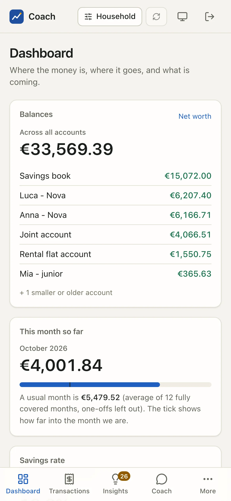
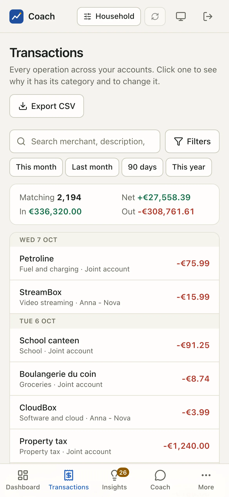
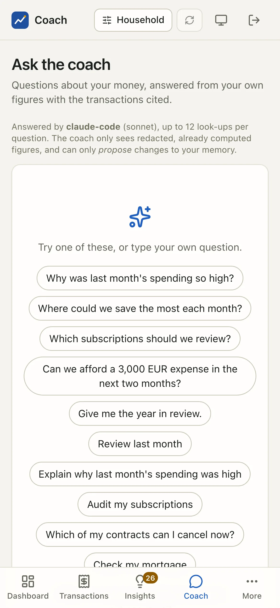

# User guide

The web app is where you see your household's money: every figure is computed by code on your own machine, and every page explains where it comes from.

<video class="cast" src="../assets/video/tour.mp4" poster="../assets/video/tour.webp" autoplay muted loop playsinline></video>

This guide walks through the app page by page, on the synthetic demo household (the Rossi family: Anna, Luca, Mia and Noa). Every name,
bank, merchant and amount you see is invented.

## Signing in

The app never signs you in from a plain page load. You open it with a **one-time login link** that `coach ui` prints in its own terminal.

=== "uv"

    ```bash
    uv run coach ui                 # starts the app and opens your browser on the login link
    uv run coach ui --login-link    # prints a fresh link (the server may already be running)
    ```

=== "Docker"

    ```bash
    docker compose exec coach coach ui --login-link
    ```

How the link works, and why:

| What | Why |
|---|---|
| The token sits in the URL **fragment** (`/login#t=...`) | A browser never sends a fragment to a server, a log or a Referer header. |
| It works **once**, for **2 minutes** | A link left in a terminal scrollback is useless a minute later. |
| The page trades it for a **session cookie** and removes it from the address bar | The cookie is HttpOnly, SameSite=Strict, signed, and lasts `[ui] session_hours` (12 by default). |
| **Sign out** revokes the session on the server | A copied cookie stops working too. |

Lost the link, or it already worked once? The login page tells you how to print a fresh one. `coach ui --rotate-session-key` signs every
browser out at once.

!!! tip "One login per person"
    Each adult or child can have their own login, created in a terminal with `coach users`. `coach ui --login-link --user ID` prints the
    one-time link of that login. A child login sees only "My money": their own balance, spending, limits and pocket money, and no other page.
    See [Household & kids](household.md).

## The layout

<figure class="shot" markdown>
{ loading=lazy }
{ loading=lazy }
<figcaption>The sidebar on the left, the top bar above every page.</figcaption>
</figure>

### Sidebar

The first entries are the ones you open every day: **Dashboard**, **Transactions**, **Insights**, **Alerts** and **Ask the coach**. Then three sections:

| Section | Pages |
|---|---|
| **Plan** | Categories, Review, Budgets, Subscriptions, Loans & net worth, Rental property, Calendar |
| **People** | Household, Kids' money, Who pays what |
| **System** | Set up, Memory, Connections, Gold set, AI usage |

Badges count what waits for you (insights, alerts, merchants to review, memory items), and a dot next to **Connections** flags a bank
consent that needs attention. The footer reminds you: "Local only. Your data never leaves this machine."

### Top bar

| Control | What it does |
|---|---|
| **Household** | The person switch. Narrow every figure to one person (what is attributed to them) or to the accounts used for one purpose. Pages about the whole household (net worth, connections, memory) ignore it. |
| **Connection warning** | Appears when a bank consent is close to expiry or a sync failed ("Connection needs action" when it is urgent). |
| **Sync now** | Pulls new transactions. The daily limit per account applies. |
| Language | English, French or Italian. It also sets the format of dates, numbers and money. |
| Theme | Cycles between system, light and dark. |
| Sign out | Ends this browser session (revoked on the server). |

## On a phone

The layout is mobile-first. On a narrow screen the sidebar becomes a **bottom tab bar** (Dashboard, Transactions, Insights, Coach, and
**More** for every other page), and dialogs open as **bottom sheets**. The app is a PWA: you can add it to your home screen, and an offline
shell shows the app frame when the server is not reachable (the data always need the local server).

<div class="phones" markdown>
{ loading=lazy }
{ loading=lazy }
{ loading=lazy }
</div>

To reach the app from your phone, see [Connections](connections.md) and the [web app reference](../ui.md#configuration): remote access goes
through an HTTPS proxy such as Tailscale, never the open internet.

## Comfort and accessibility

- **Dark and light** follow your system, with the toggle in the top bar to force one.
- **Keyboard**: every control is reachable with ++tab++, focus is always visible, a "Skip to content" link comes first, and dialogs trap
  the focus and close with ++esc++.
- **A Table alternative for every chart**: each chart has a **Table** switch that shows the same numbers as a table, for screen readers
  and for anyone who wants the exact figures.

## Privacy by construction

- No CDN, no external font, no analytics, no telemetry: everything is bundled, and the Content Security Policy forbids anything else.
- The app listens on `127.0.0.1` only, unless you explicitly allow a remote host behind an HTTPS proxy.
- The frontend holds no business logic: it formats what the analytics computed.
- Memory changes that the coach suggests are **proposals**. The page shows them; you accept them yourself in a terminal.

## The pages

<div class="grid cards" markdown>

-   **[Dashboard](dashboard.md)**

    Balances, this month against a usual month, cash flow, the 90-day forecast, and what needs you.

-   **[Transactions](transactions.md)**

    Every operation, filtered and totalled, with why each one has its category and how to change it.

-   **[Categories & review](categories.md)**

    A usual month per category, drill-downs, and the queue of labels the app is unsure about.

-   **[Budgets & goals](budgets.md)**

    Monthly envelopes with a projected month end, suggestions, and savings goals.

-   **[Subscriptions & contracts](subscriptions.md)**

    Every recurring cost, contract status, cancellation rules, cheaper offers and the savings you achieved.

-   **[Loans & net worth](wealth.md)**

    What you own and owe, from real amortization schedules. Unknowns are listed, never guessed.

-   **[Rental property](rental.md)**

    Cash flow and P&L, the scheme commitment, tax-year candidates and neutral indicators.

-   **[Calendar](calendar.md)**

    Recurring payments, instalments, renewals and consents on a month grid, with an `.ics` download.

-   **[Insights & alerts](insights-alerts.md)**

    Anomalies, price changes, reminders, and the alert events with their channels.

-   **[Ask the coach](coach.md)**

    Ask questions in plain words. The answer cites the evidence it rests on.

-   **[Memory & set-up](memory.md)**

    Open questions, proposals, loans, contracts, assets, and the first-run checklist.

-   **[Household & kids](household.md)**

    Members, account owners, attribution rules, kids' money and who pays what.

-   **[Connections](connections.md)**

    Bank consents, sync, accounts and internal transfers.

-   **[Quality & AI usage](quality.md)**

    The gold set that measures the categories, and what the AI calls cost.

</div>

## See also

- [Web app reference](../ui.md): every page, the security model and the API.
- [Languages](../i18n.md): how the interface is translated.
- [Security](../security.md) and [Privacy](../privacy.md).
